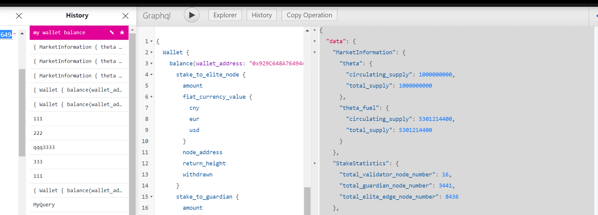

# Introduction

## What is Theta Data

Theta Data is a Data Explorer and Analytics Platform for Theta Network.
It collects data from Guardian Node, performs analysis and provides data and analysis result through convenient Graphql interfaces.
Users can access the data with simple statements and queries.

## User Interface



We provide a simple GUI for basic queries. With box checking, you can look up the relevant data of your own interest. History queries will be saved so that you do not need to rewrite the statements.

## Why choose Theta Data

Unlike traditional interface, Theta Data provides an efficient and concise way to retrieve on-chain data.

The below example shows the difference between a traditional interface and Theta Data API when you are collecting the block height, staking amount and the circulating supply of Theta token/Theta Fuel

### Example of traditional data interface

1. Get the latest block height with js sdk

```javascript
const provider = new thetajs.providers.HttpProvider()
const blockHeight = await provider.getBlockNumber()
```

2. Get Theta staking amount through browser interface

```shell
// Request
curl https://explorer.thetatoken.org:8443/api/stake/totalAmount

// Result
{
  "type":"stakeTotalAmout",
  "body":{
    "totalAmount":"644011157483502419243726104",
    "totalNodes":3457,
    "type":"theta"
    }
}
```

3. Get the supply and circulation of Theta with explorer api

```shell
// Request
curl https://explorer.thetatoken.org:8443/api/supply/theta

// Result
{
   "total_supply":1000000000,
   "circulation_supply":1000000000
}
```

4. Call explorer api again to get the supply and circulation of theta fuel

```shell
// Request
curl https://explorer.thetatoken.org:8443/api/supply/tfuel

// Result
{
   "circulation_supply":5000000000
}
```

We can see from above, in order to get the basic data, we need to call 4 different APIs. These APIs are from different source, which makes them difficult to maintain in our own program.

### Example of Theta Data API

With Theta Data, all the data above can be retrieve with one single Graphql statement and one request.

Request:

```graphql
{
  MarketInformation {
    Theta {
      circulating_supply
      total_supply
    }
    ThetaFuel {
      circulating_supply
      total_supply
    }
  }
  StakeStatistics {
    total_validator_node_number
    total_guardian_node_number
    total_elite_edge_node_number
  }
  ThetaRpc {
    GetStatus {
      current_height
    }
  }
}
```

Response:

```json
{
  "data": {
    "MarketInformation": {
      "theta": {
        "circulating_supply": 1000000000,
        "total_supply": 1000000000
      },
      "theta_fuel": {
        "circulating_supply": 5301214400,
        "total_supply": 5301214400
      }
    },
    "StakeStatistics": {
      "total_validator_node_number": 16,
      "total_guardian_node_number": 3441,
      "total_elite_edge_node_number": 8436
    },
    "ThetaRpc": {
      "GetStatus": {
        "current_height": "12806717"
      }
    }
  }
}
```

It is also worth mentioning that Theta Data only returns the data you specify in the query statement. No redundant fields will be returned.

## Data source and service stability

Since the whole project is open sourced, the data source can be audited through the [source code](https://github.com/theta-data/theta-data-api).

Except for market-related data which is obtained from [Coinmarketcap](https://coinmarketcap.com/), all our data is obtained from Guardian Node. Therefore, our data service is independent from any other third-party data services.

If you have massive data demand and are concerned with the stability of our service, please contract [us](*****@****.com) for further support.

You can also pull our code and deploy Theta Data to your own server so that you can retrieve data from your Guardian node.

This project is licensed under the terms of the MIT license.
